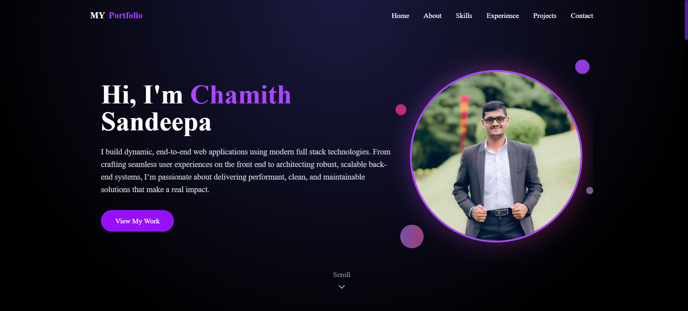
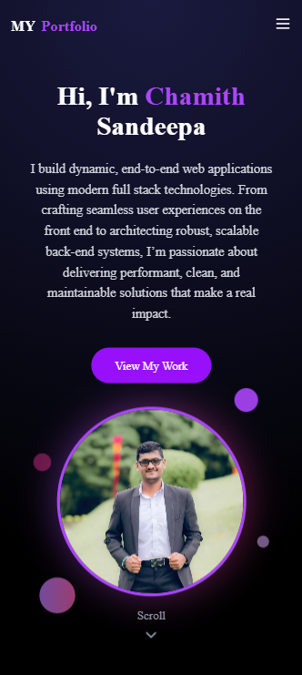

# Personal Portfolio Website 💼

A modern, visually engaging portfolio website built with React, Tailwind CSS, and Framer Motion to showcase my projects, skills, and professional experience.


## 🌐 Live Demo

**[View Live Portfolio](https://my-portfolio-nu-woad-65.vercel.app)**

## 🔗 Repository

**[GitHub](https://github.com/chamithsandeepa/My-Portfolio)**

---

## 🎯 Overview

A fully responsive personal portfolio website designed to create a strong online presence and showcase my journey as a developer. Built with modern web technologies and focused on clean design, accessibility, and performance.

**Project Timeline**: Apr 2025 – Jul 2025 (Individual Project)

---

## ✨ Features

- **Responsive Design**: Fully optimized for desktop, tablet, and mobile devices
- **Smooth Animations**: Scroll-based animations and interactive elements using Framer Motion
- **Modern UI**: Clean, minimalist design with Tailwind CSS
- **Project Showcase**: Detailed presentation of personal projects with live demos and GitHub links
- **Skills Section**: Visual representation of technical skills and expertise
- **About Me**: Professional introduction and background
- **Contact Form**: Easy way for visitors to get in touch
- **Fast Performance**: Optimized loading times and smooth interactions
- **Accessibility**: WCAG compliant for better user experience
- **SEO Optimized**: Improved visibility in search engines

---

## 🛠 Technologies Used

- **React.js** – Component-based UI library
- **Vite** – Fast build tool and development server
- **Tailwind CSS** – Utility-first CSS framework
- **Framer Motion** – Animation library for React
- **React Icons** – Icon library
- **Vercel** – Deployment platform

---

## 🚀 Getting Started

### Prerequisites

- Node.js (v16 or higher)
- npm or yarn
- Git

### Installation

1. **Clone the repository**
```bash
git clone https://github.com/chamithsandeepa/My-Portfolio.git
cd My-Portfolio
```

2. **Install dependencies**
```bash
npm install
```

3. **Start development server**
```bash
npm run dev
```

4. **Open your browser**
   
   Navigate to `http://localhost:5173`

---

## 📜 Available Scripts
```bash
npm run dev      # Start development server
npm run build    # Build for production
npm run preview  # Preview production build
npm run lint     # Run ESLint
```

---

## 📂 Project Sections

### Hero Section
- Eye-catching introduction with animated elements
- Call-to-action buttons
- Professional headshot or avatar

### About Me
- Brief professional introduction
- Background and experience
- Personal interests and goals

### Skills
- Technical skills with proficiency levels
- Tools and technologies
- Visual skill indicators

### Projects
- Featured projects with descriptions
- Live demo and GitHub links
- Tech stack used for each project
- Project screenshots

### Experience
- Professional experience timeline
- Education background
- Certifications and achievements

### Contact
- Contact form for inquiries
- Social media links
- Email and location information

---

## 🎨 Key Features Implementation

### Framer Motion Animations
```jsx
// Smooth scroll-based animations
<motion.div
  initial={{ opacity: 0, y: 50 }}
  whileInView={{ opacity: 1, y: 0 }}
  transition={{ duration: 0.5 }}
>
  {/* Content */}
</motion.div>
```

### Tailwind CSS Styling
- Utility-first approach for rapid development
- Custom color schemes
- Responsive design with breakpoints
- Dark mode support (if implemented)

### Interactive Elements
- Hover effects on project cards
- Smooth scrolling navigation
- Animated skill bars
- Interactive buttons

---

## 🌐 Deployment

### Deployed on Vercel

The portfolio is automatically deployed on Vercel with continuous deployment from the main branch.

**Live URL**: [https://my-portfolio-nu-woad-65.vercel.app](https://my-portfolio-nu-woad-65.vercel.app)

### Deploy Your Own

1. **Fork this repository**

2. **Import to Vercel**
   - Go to [Vercel](https://vercel.com)
   - Click "New Project"
   - Import your forked repository
   - Deploy!

3. **Custom Domain (Optional)**
   - Add your custom domain in Vercel settings

---

## 📱 Responsive Breakpoints
```css
/* Mobile */
@media (max-width: 640px) { }

/* Tablet */
@media (min-width: 641px) and (max-width: 1024px) { }

/* Desktop */
@media (min-width: 1025px) { }
```

---

## 🎯 Future Enhancements

- Blog section for sharing knowledge
- Dark/Light theme toggle
- Multi-language support
- Testimonials section
- Download resume functionality
- Analytics integration
- Newsletter subscription
- More interactive animations
- Project filtering by technology

---

## 🛠 Customization Guide

### Update Personal Information

1. **Edit content** in `src/data/portfolio.js` (or relevant data file)
2. **Replace images** in `public/images/`
3. **Update social links** in the Contact section
4. **Modify color scheme** in `tailwind.config.js`

### Add New Projects
```jsx
const newProject = {
  title: "Project Name",
  description: "Project description",
  technologies: ["React", "Node.js", "MongoDB"],
  liveLink: "https://project-demo.com",
  githubLink: "https://github.com/username/repo",
  image: "/images/project-screenshot.png"
};
```

---

## 📸 Screenshots

_Add screenshots of your portfolio here_

### Desktop View


### Mobile View



---

## 📬 Contact

**Chamith Sandeepa**

- 📧 Email: your.email@example.com
- 💼 LinkedIn: [linkedin.com/in/chamithsandeepa](#)
- 🐙 GitHub: [@chamithsandeepa](https://github.com/chamithsandeepa)
- 🌐 Portfolio: [my-portfolio-nu-woad-65.vercel.app](https://my-portfolio-nu-woad-65.vercel.app)

---

**Made with ❤️ by Chamith Sandeepa**

⭐ **If you like this portfolio, please give it a star!**

---

### 📊 Project Stats


